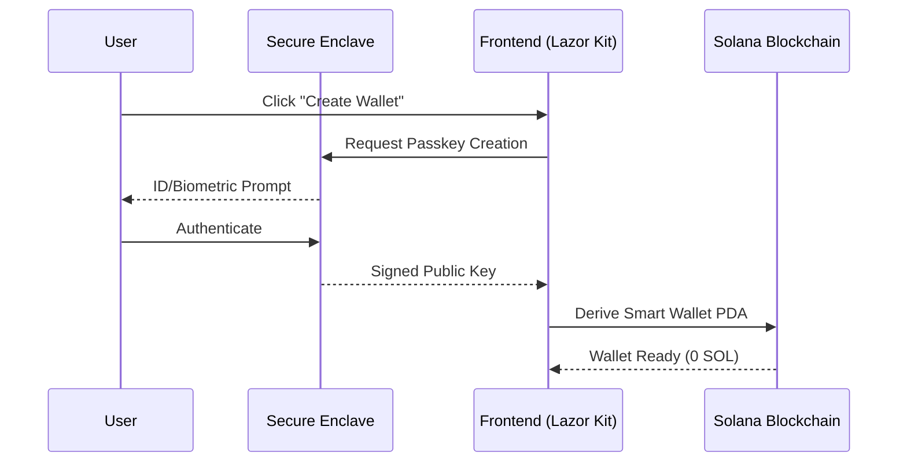

# Passkey Wallet Tutorial

## What is a Passkey Wallet?

CadPay uses **passkey-based authentication** powered by Lazorkit, eliminating the need for traditional seed phrases. Your wallet is secured using your device's biometric authentication (Face ID, Touch ID, or Windows Hello).

## How It Works

### 1. **Account Creation**
When you create a wallet:
- No seed phrase is generated
- A cryptographic key pair is created and stored securely in your device's hardware
- The private key never leaves your device
- Your biometric data authenticates signing operations

### 2. **Authentication Flow**


### 3. **The Smart Wallet PDA**
Your actual wallet address is a **Program Derived Address (PDA)**. Unlike traditional wallets where the address is the public key, a smart wallet address is deterministically calculated using:
- The Lazor Kit Program ID
- Your Passkey Public Key
- A "salt" or index

This ensures that even though you use a Passkey, you have a consistent, secure address on-chain.
✅ **No seed phrase to lose or forget**  
✅ **Phishing resistant** - keys can't be typed or copied  
✅ **Hardware-backed security** - keys stored in secure enclave  
✅ **Cross-device sync** (via iCloud/Google Password Manager)  

## Implementation in CadPay

### Customer Side
1. Navigate to `/signin`
2. Click "Create Wallet"
3. Authenticate with your biometric
4. Done! Your wallet is ready

### Code Example
```typescript
import { useWallet } from '@lazorkit/wallet';

const { connect, isConnected, smartWalletPubkey } = useWallet();

// Create/Connect wallet
await connect(); // Triggers biometric prompt

// Sign transaction (no seed phrase needed!)
const signature = await signAndSendTransaction(transaction);
```

### 1. **On-Chain Initialization** (The "Magic")
When you first log in, CadPay checks if your `UserProfile` exists on-chain. If not, it triggers the `initializeUser` instruction in our Anchor program.

**What happens during initialization?**
1. **Space Allocation**: The program allocates bytes on the Solana ledger for your username, avatar, and settings.
2. **Rent Payment**: To stay on the ledger, an account must be "Rent Exempt" (usually cost ~0.002 SOL). **The Private Faucet sponsors this initially.**
3. **Data Binding**: Your Smart Wallet address is permanently linked to this `UserProfile` account.

```rust
// Anchor Program Logic (Simplified)
pub fn initialize_user(ctx: Context<InitializeUser>, username: String) -> Result<()> {
    let user_profile = &mut ctx.accounts.user_profile;
    user_profile.authority = ctx.accounts.signer.key();
    user_profile.username = username;
    Ok(())
}
```

## Troubleshooting

### "Authentication failed"
- Ensure you're on `localhost` or `https://` (passkeys require secure context)
- Check that biometrics are enabled on your device
- Try clearing browser cache and reconnecting

### "Wallet not found"
- The wallet is device-specific - you'll need to recreate on new devices
- Consider exporting recovery options if needed

## Best Practices

1. **Enable iCloud Keychain** (iOS) or **Google Password Manager** (Android) for backup
2. **Test on localhost first** before deploying
3. **Consider fallback authentication** for users without biometrics
4. **Educate users** that their "password" is their face/fingerprint

## Resources
- [Lazorkit Documentation](https://docs.lazorkit.com/)
- [WebAuthn Specification](https://www.w3.org/TR/webauthn-2/)
- [Passkeys.dev](https://passkeys.dev/)

---

---

## 🌐 Project Links

- **Live Demo:** [https://cadpay.vercel.app/](https://cadpay.vercel.app/)
- **GitHub Repository:** [https://github.com/SamuelOluwayomi/solana-subscriptions-starter](https://github.com/SamuelOluwayomi/solana-subscriptions-starter)
- **Watch the Demo:** [Demo Video Coming Soon]

**Next:** Learn about [Gasless Transactions →](./TUTORIAL_GASLESS_TRANSACTIONS.md)
